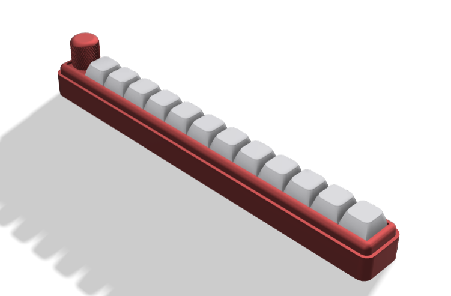
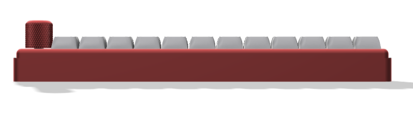
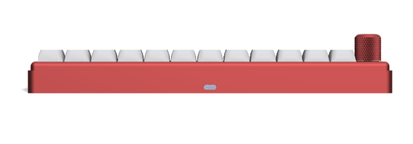
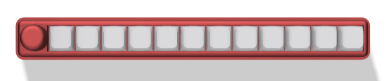

# 12pad-QMK-VIA

Macropad 12 tombol + 1 knob encoder oleh **Positron Electronic**.

## Spesification
- STM32F401 (WeAct Blackpill, USB Type-C) as Microcontroller
- QMK Firmware
- Support VIA, all keys and knob can be programmed
- 12 x Hotswap Switch
- 1 x Knob Encoder
- 12 x RGB (WS2812), 6 layers, 32 macros
- USB ID: VID `0x1209` / PID `0x2012` ([pid.codes](https://pid.codes), Positron Electronic 12pad)

## Buku Panduan (User Manual)
- **[Buku Panduan 12pad (PDF)](DOC/Buku%20Panduan%2012pad.pdf)** — peta 6 layer, cara setting VIA, macro, RGB, dan update firmware
- [Kertas Panduan 12pad (PDF)](Kertas%20Panduan%2012pad.pdf)

## Firmware
Firmware siap pakai ada di folder [`FIRMWARE/`](FIRMWARE):

| File | Keterangan |
|---|---|
| `positron_12pad_via.bin` | **Untuk pengguna** — VIA aktif (STM32F401) |
| `positron_12pad_default.bin` | Keymap default tanpa VIA (STM32F401) |
| `12pad_rp2040_default.uf2` | Varian RP2040 |

Source code keyboard: [`FIRMWARE/positron/12pad/`](FIRMWARE/positron/12pad) — build otomatis via GitHub Actions setiap ada perubahan (unduh hasil build terbaru di tab Actions → artifact).

### Cara Flash (STM32)
1. Masuk bootloader: cabut USB, **tahan knob**, colok USB (atau tahan tombol `BOOT0` di board saat colok USB)
2. Buka [QMK Toolbox](https://github.com/qmk/qmk_toolbox/releases), open file `.bin`, klik **Flash**

Atau lewat terminal:

```sh
dfu-util -a 0 -d 0483:df11 -s 0x08000000:leave -D positron_12pad_via.bin
```

## Status Pendaftaran Resmi (Roadmap Autodetect)
1. **USB VID/PID sendiri** — `0x1209:0x2012` diajukan ke [pid.codes PR #1249](https://github.com/pidcodes/pidcodes.github.com/pull/1249) ✅ checks lulus, menunggu merge
2. **QMK upstream** — keyboard `positron/12pad` diajukan ke [qmk/qmk_firmware PR #26362](https://github.com/qmk/qmk_firmware/pull/26362) ✅ CI lulus, menunggu review
3. **VIA autodetect** — setelah QMK merge, definisi V3 di-PR ke [the-via/keyboards](https://github.com/the-via/keyboards) (file sudah siap: `12pad_via_definitions.json`)

Sebelum tahap 3 selesai, gunakan sideload JSON (lihat "Load JSON File" di bawah).

## VIA
- You can download VIA from this [link](https://github.com/the-via/releases/releases)
- or you can go to this [web](https://usevia.app/)

## Auto Detect VIA
This device can be automatically detected by VIA, just need a PC with an internet connection:
- Connect your macropad to the PC
- Open VIA
- It will auto detect

## Load JSON File
Or you can load the JSON file manually, like a library for detecting this macropad:
- Connect your macropad to the PC
- Open VIA
- In tab Settings, enable "Show Design Tab"
- Open the Design tab
- Load the file named `12pad_via_definitions.json`
- Open the Configure tab to set up your macropad
- If nothing happens, repeat from the first step

## Cara Setting Knob
Untuk melakukan setting di knob perlu memasukkan command berupa keycode QMK. Jadi caranya sama dengan melakukan setting dengan Any key seperti petunjuk pada link berikut:
https://docs.keeb.io/via

Here are some examples:

- LALT(KC_TAB) - Sends Alt-Tab
- LCTL(KC_C) - Sends Ctrl-C
- LGUI(KC_C) - Sends Cmd-C or Win-C
- LSFT(LCTL(KC_END)) - Sends Shift-Ctrl-End
- MO(1) - Momentarily turn on layer 1
- LCA(KC_DEL) - Sends Ctrl-Alt-Del
- MT(MOD_RSFT, KC_ENT) - Sends Shift if held, Enter if tapped
- M0 … M31 - Run macro 0–31

## Link Keycode QMK
- mouse: https://github.com/qmk/qmk_firmware/blob/master/docs/features/mouse_keys.md
- keyboard: https://docs.qmk.fm/keycodes

## How To Use MACRO
- Read the guide: [MACRO VIA USAGE (PDF)](DOC/MACRO%20VIA%20USAGE.pdf)
- Or read this [web tutorial](https://www.keychron.com/blogs/archived/how-to-use-via-to-program-your-keyboard)
- Or watch this [YouTube video](https://youtu.be/GtSeo69Y0Zw)

## Preview Design
<p align="center">
    
    
    
    
</p>

## Tutorial VIA Usage
- https://docs.keeb.io/via

## Preview VIA

https://github.com/juarendra/Lianumpad-QMK-VIA/assets/43043633/daf05cb3-5ffb-4896-910a-576f78afdfc5

## Pinout Hardware
[Pinout Hardware](DOC/WIRING%20MACROPAD%2012PAD%20BY%20POSITRON%20ELEKTRONIK.drawio.pdf)

## License
Firmware is licensed under [GPL-2.0](LICENSE).
