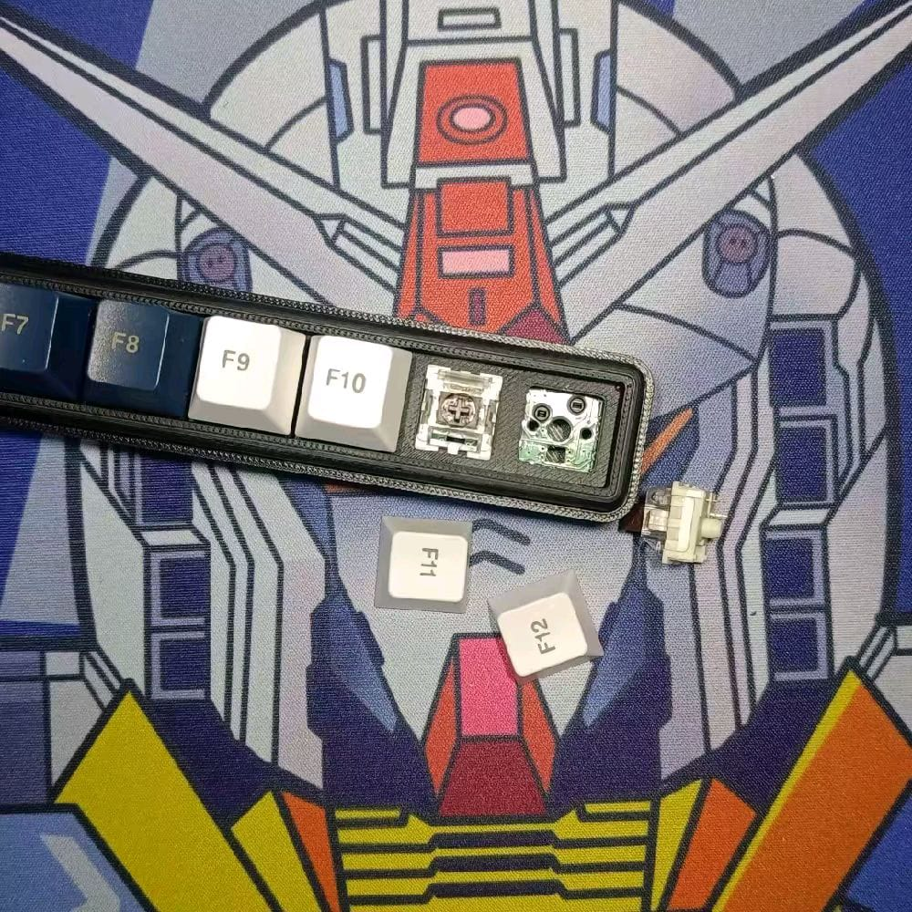
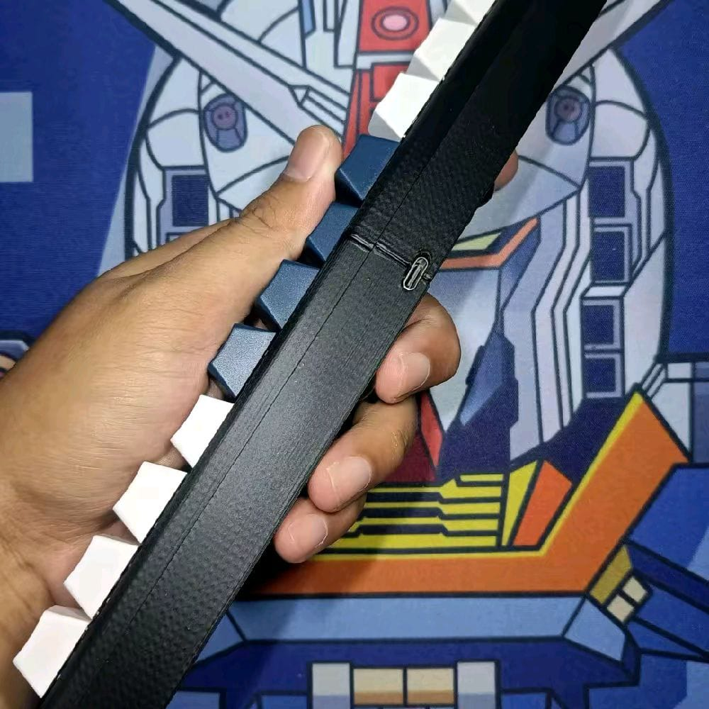

<div align="center">


# 12pad

**Macropad 12 tombol hotswap + knob putar — semua tombol bisa diprogram lewat VIA, tanpa driver, tanpa coding.**

oleh [Positron Electronic](https://github.com/juarendra)

[](https://github.com/juarendra/12pad-QMK-VIA/actions/workflows/build.yml)
[](https://github.com/juarendra/12pad-QMK-VIA/releases/latest)
[](https://qmk.fm)
[](https://usevia.app)
[](LICENSE)

[⬇️ Unduh Firmware](https://github.com/juarendra/12pad-QMK-VIA/releases/latest) ·
[📖 Buku Panduan](DOC/Buku%20Panduan%2012pad.pdf) ·
[🎛️ Buka VIA](https://usevia.app) ·
[🔌 Wiring](DOC/WIRING%20MACROPAD%2012PAD%20BY%20POSITRON%20ELEKTRONIK.drawio.pdf)

</div>

---

## ✨ Fitur

| | |
|---|---|
| ⌨️ **12 tombol hotswap** | Ganti switch tanpa solder |
| 🎚️ **Knob rotary encoder** | Putar = scroll/volume, tekan = pindah layer — bebas diatur |
| 🌈 **RGB per tombol** | 40+ efek, atur dari VIA atau langsung dari macropad (Layer 5) |
| 🧠 **6 layer × 32 macro** | Profil per aplikasi, tersimpan di dalam macropad |
| 🔧 **QMK + VIA** | Atur keymap real-time di [usevia.app](https://usevia.app), tanpa install apa pun |
| 🔌 **STM32F401 · USB-C** | WeAct Blackpill, identitas USB resmi `0x1209:0x2012` |

<div align="center">
 
</div>

## 🚀 Mulai dalam 3 langkah

1. **Colok USB-C** — langsung dikenali sebagai keyboard, tanpa driver
2. **Buka [usevia.app](https://usevia.app)** di Chrome/Edge (internet menyala)
3. **Klik & atur** — pilih tombol di layar, ganti fungsinya, tersimpan otomatis di macropad

> VIA belum mendeteksi? Lihat [Load JSON File](#-load-json-file-sideload) di bawah.

📖 Panduan lengkap (peta layer, macro, RGB, troubleshooting): **[Buku Panduan 12pad (PDF)](DOC/Buku%20Panduan%2012pad.pdf)**

## ⌨️ Keymap bawaan

Tekan knob untuk berpindah layer (0 → 1 → … → 5 → 0).

| Layer | Isi |
|---|---|
| **0** | `F1`–`F12` — siap dipetakan ke shortcut aplikasi · putar knob = Page Up/Down |
| **1–4** | Kosong (transparan) — kanvas bebas untuk profil per aplikasi |
| **5** | Panel kontrol RGB: on/off, efek, kecepatan, saturasi, hue, kecerahan |

## 📦 Firmware

**Unduh siap pakai:** [**Releases — versi terbaru**](https://github.com/juarendra/12pad-QMK-VIA/releases/latest)

| File | Untuk |
|---|---|
| `positron_12pad_via.bin` | ✅ **Pengguna STM32F401** — VIA aktif |
| `positron_12pad_default.bin` | STM32F401, keymap default tanpa VIA |
| `12pad_rp2040_default.uf2` | Varian RP2040 |

<details>
<summary><b>Cara flash (STM32)</b></summary>

1. Masuk bootloader: cabut USB, **tahan knob**, colok USB — atau tahan tombol `BOOT0` di board saat colok USB
2. Buka [QMK Toolbox](https://github.com/qmk/qmk_toolbox/releases) → Open file `.bin` → **Flash**

Atau lewat terminal:

```sh
dfu-util -a 0 -d 0483:df11 -s 0x08000000:leave -D positron_12pad_via.bin
```

Setelah flash, identitas USB berubah menjadi **"Positron Electronic 12pad"** — load ulang `12pad_via_definitions.json` terbaru di VIA bila sebelumnya pernah sideload.
</details>

<details>
<summary><b>Build dari source</b></summary>

Source keyboard: [`FIRMWARE/positron/12pad/`](FIRMWARE/positron/12pad). Salin ke `qmk_firmware/keyboards/positron/12pad`, lalu:

```sh
qmk compile -kb positron/12pad -km via
```

Setiap push ke folder firmware juga dibuild otomatis oleh [GitHub Actions](https://github.com/juarendra/12pad-QMK-VIA/actions) — unduh `.bin` dari artifact.
</details>

## 🎛️ VIA

### Auto detect
Colok macropad → buka [usevia.app](https://usevia.app) atau [aplikasi VIA](https://github.com/the-via/releases/releases) dengan internet aktif → terdeteksi otomatis.

### 📂 Load JSON File (sideload)
Kalau belum terdeteksi (definisi resmi masih dalam proses):

1. Colok macropad, buka VIA
2. Tab **Settings** → aktifkan **Show Design Tab**
3. Tab **Design** → **Load** file [`12pad_via_definitions.json`](12pad_via_definitions.json)
4. Buka tab **Configure** — siap diatur
5. Masih "searching"? Cabut-colok USB, ulangi dari langkah 3

### 🎚️ Setting knob
Knob tampil sebagai 3 "tombol" di VIA: putar kiri · tekan · putar kanan. Untuk kombinasi khusus pakai **Any** (kategori Special) dengan keycode QMK:

| Keycode | Hasil |
|---|---|
| `LALT(KC_TAB)` | Alt + Tab |
| `LCTL(KC_C)` | Ctrl + C |
| `LSFT(LCTL(KC_END))` | Shift + Ctrl + End |
| `MT(MOD_RSFT, KC_ENT)` | Tahan = Shift, ketuk = Enter |
| `MO(1)` / `TO(2)` | Pindah layer sementara / permanen |
| `M0` … `M31` | Jalankan macro |

Referensi: [Keycode QMK](https://docs.qmk.fm/keycodes) · [Panduan VIA](https://docs.keeb.io/via) · [Macro VIA (PDF)](DOC/MACRO%20VIA%20USAGE.pdf) · [Video tutorial](https://youtu.be/GtSeo69Y0Zw)

## 🛠️ Hardware

- [Dimensi (PDF)](HARDWARE/12pad_dimension.pdf) · [Model 3D STEP](HARDWARE/12pad.step)
- [Case 3D-printable (STL)](HARDWARE/case) — top & bottom, tersedia versi terbelah 2 untuk printer kecil
- [Wiring diagram](DOC/WIRING%20MACROPAD%2012PAD%20BY%20POSITRON%20ELEKTRONIK.drawio.pdf)

## 🗺️ Status Pendaftaran Resmi

| Tahap | Status |
|---|---|
| USB VID/PID `0x1209:0x2012` — [pid.codes #1249](https://github.com/pidcodes/pidcodes.github.com/pull/1249) | ✅ checks lulus, menunggu merge |
| QMK upstream — [qmk_firmware #26362](https://github.com/qmk/qmk_firmware/pull/26362) | ✅ CI lulus, menunggu review |
| VIA autodetect global — PR ke [the-via/keyboards](https://github.com/the-via/keyboards) | ⏳ setelah QMK merge (file sudah siap) |

## 📄 License

Firmware dilisensikan di bawah [GPL-2.0](LICENSE).

<div align="center">
<sub>Dibuat dengan ☕ oleh <b>Positron Electronic</b> · Indonesia</sub>
</div>
